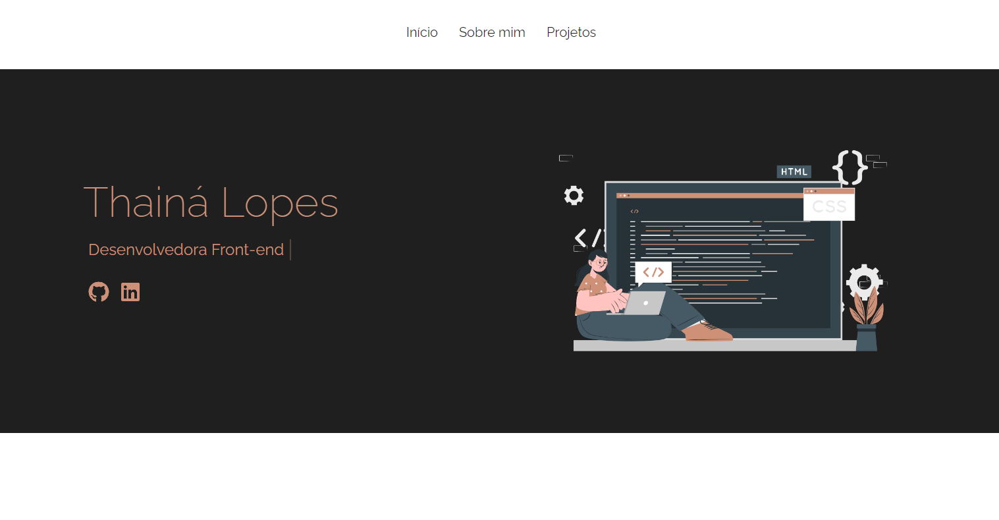

<h1 align="center">
  💻 Bem-vindo(a) ao meu portfólio!
</h1>

Como desenvolvedroa front-end, decidi criar um portfólio para mostrar alguns dos meus projetos, tecnologias que domino e também falo um pouco sobre mim e minhas experiências.
O portfólio é responsivo, visando entregar uma boa experiência para usuários em diversos dispositivos.

<h4 align="center"><a href="https://portfolio-thaina.vercel.app/">Clique para visitar o projeto</a></h4>

## 📚 Seções

O site é composto por três seções:

- **Home:** Uma breve apresentação e minhas redes sociais;
- **Sobre mim:** Descrição falando um pouco sobre mim;
- **Projetos:** Apresento alguns projetos desenvolvidos;

---

## 💼 Tecnologias utilizadas

Para o desenvolvimento deste site utilizei as seguintes tecnologias:

- HTML;
- CSS;
- JavaScript;
- React;

---

<h2>🦄 Autora</h2>

<table>
  <tr>
    <td align="center">
      <a href="https://github.com/thaina-lopes">
         
      </a>
    </td>
  </tr>
</table>
